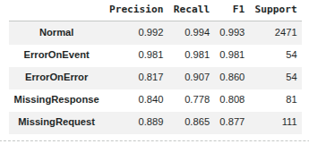
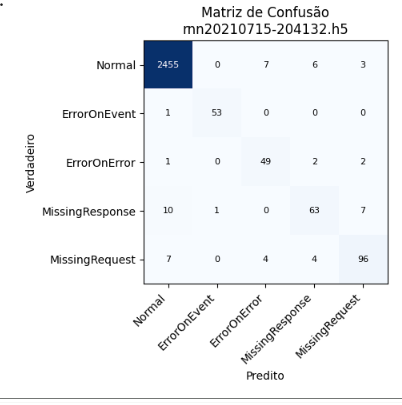
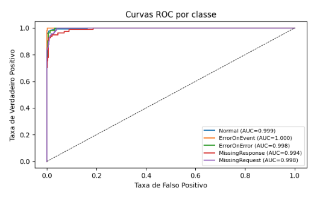

# Relatório de Experimento — Reprodução do IDS RNN para SOME/IP (Alkhatib et al., 2021)

**Trabalho original:** N. Alkhatib, J.-L. Danger, H. Ghauch. *SOME/IP Intrusion Detection
using Deep Learning-based Sequential Models in Automotive Ethernet Networks.* IEEE IEMCON, 2021.
**Execução:** Google Colab, GPU NVIDIA Tesla T4 (junho/2026).
**Notebook:** [`Alkhatib2021_repro.ipynb`](../Alkhatib2021_repro.ipynb)

---

## 1. Contexto

O protocolo **SOME/IP** (middleware orientado a serviços da Automotive Ethernet) não possui
mecanismos de segurança nativos. Alkhatib et al. (2021) foram os primeiros a aplicar **redes
neurais recorrentes (RNN)** para detectar **anomalias do processo de comunicação** SOME/IP,
classificando cada sequência de pacotes em **5 classes**: *Normal*, *Error on Event*,
*Error on Error*, *Missing Response* (requisição sem resposta) e *Missing Request* (resposta
sem requisição). Cada amostra é uma sequência de **60 pacotes × 195 atributos** (codificação
*one-hot* do cabeçalho).

O repositório oficial dos autores publica **o dataset** e **três modelos RNN treinados**
(validação cruzada *3-fold*, em Keras) — o que torna o trabalho **diretamente verificável**.
Este experimento tem duas frentes:
1. **Verificar os modelos publicados** — rodar inferência no conjunto de teste oficial e
   comparar com a Tabela VII do artigo;
2. **Treinar o RNN do zero** (reimplementação em PyTorch) e confirmar que a arquitetura/método
   se sustentam.

---

## 2. Resultados

### 2.1 Verificação dos modelos publicados (conjunto de teste oficial, 2.771 amostras)

| Modelo | Accuracy | F1 ponderado | F1 *Error on Error* (classe difícil) |
|--------|---------:|-------------:|-------------------------------------:|
| rnn…203913 | **98,05%** | 0,980 | 0,73 |
| rnn…204024 | **97,91%** | 0,979 | 0,81 |
| rnn…204132 | **98,02%** | 0,980 | 0,86 |

Métricas por classe (modelo rnn…204132), matriz de confusão e curvas ROC:





As curvas ROC apresentam **AUC próximo de 1** para todas as classes, e a matriz de confusão é
quase diagonal — confusões residuais concentram-se em *Error on Error* (a classe mais difícil).

### 2.2 Treino do zero (PyTorch, 60 épocas, GPU)

```
Accuracy: 97,55%  | F1 ponderado: 0,976
  Normal           F1=0,99
  ErrorOnEvent     F1=1,00
  ErrorOnError     F1=0,65   <- classe difícil
  MissingResponse  F1=0,75
  MissingRequest   F1=0,90
```

---

## 3. Interpretação

- **Os modelos publicados reproduzem o artigo com fidelidade**: ~**98%** de acurácia e F1 por
  classe coincidindo com a Tabela VII. Isso confirma que, quando um trabalho publica **modelo
  treinado + conjunto de teste**, seus resultados são **verificáveis por inferência**.
- **O treino do zero** (nossa reimplementação) atinge **97,55%** — próximo dos modelos
  publicados — validando a arquitetura e o método. A diferença concentra-se na classe
  minoritária ***Error on Error***, consistentemente a mais difícil (F1 0,65–0,86 também nos
  modelos originais). Foi essencial usar *gradient clipping* para estabilizar a RNN.
- **Conclusão:** o trabalho de Alkhatib é **reprodutível**. A ressalva de produção é a
  detecção fraca da classe minoritária *Error on Error*, e o uso de dados **sintéticos**
  (sem validação em veículo real).
